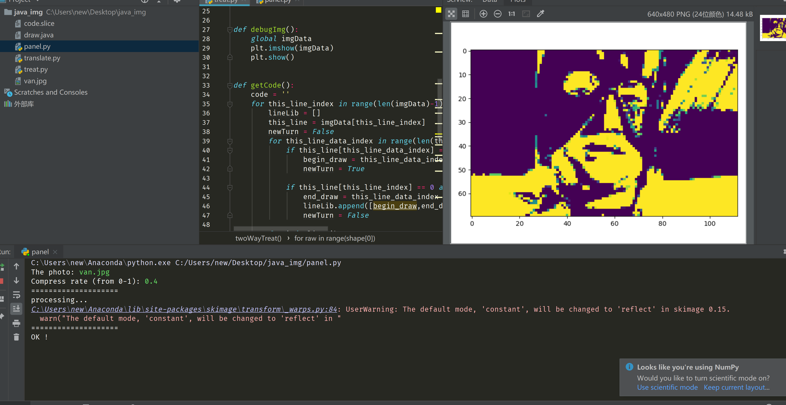

# Img2Java

It can transfer an image to `JFrame.draw` code in Java, the reason I developed it is because my school’s CS teacher let us to draw something by using Java. 

## Principle

1. load image
2. decrease dimension
3. binarize the data
4. compress data by k-mean
5. passivate the  image
6. transfer code into java

## How to run

run `panel.py` and input the imagine address and compress rate

## Passivate

To reduce the size of the file, I use passivate arithmetic, demo shows below:

**Before:**

| index | index | index | index | index |
| ----- | ----- | ----- | ----- | ----- |
| 0     | 255   | 255   | 255   | 255   |

**After:**

| index | index | index | index | index |
| ----- | ----- | ----- | ----- | ----- |
| 255   | 255   | 255   | 255   | 255   |

## Update

`2019/5/20`: add passivate arithmetic

## DEMO

